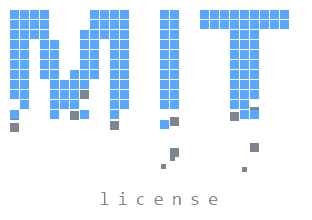
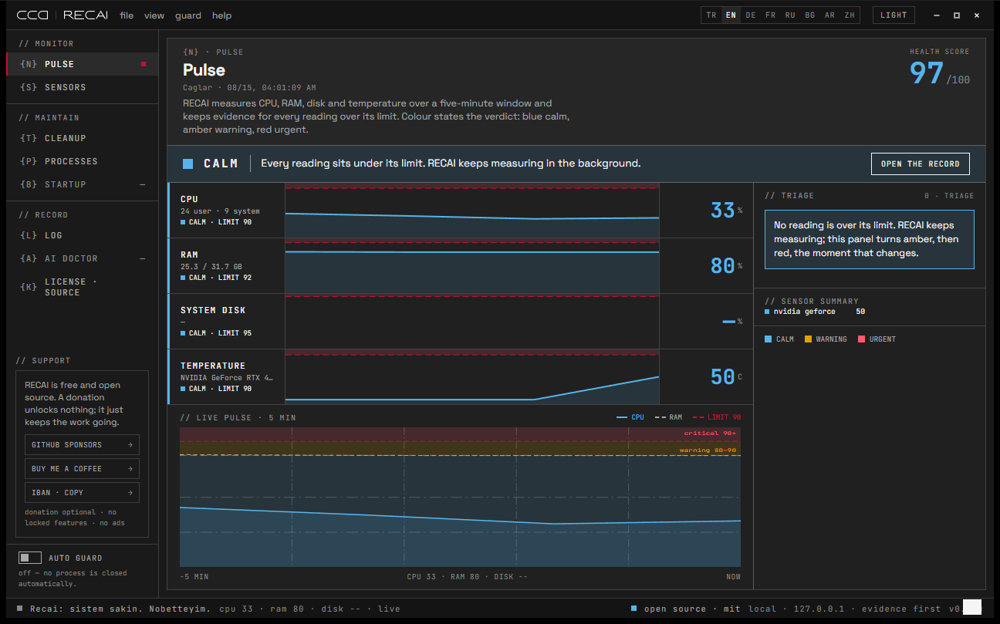
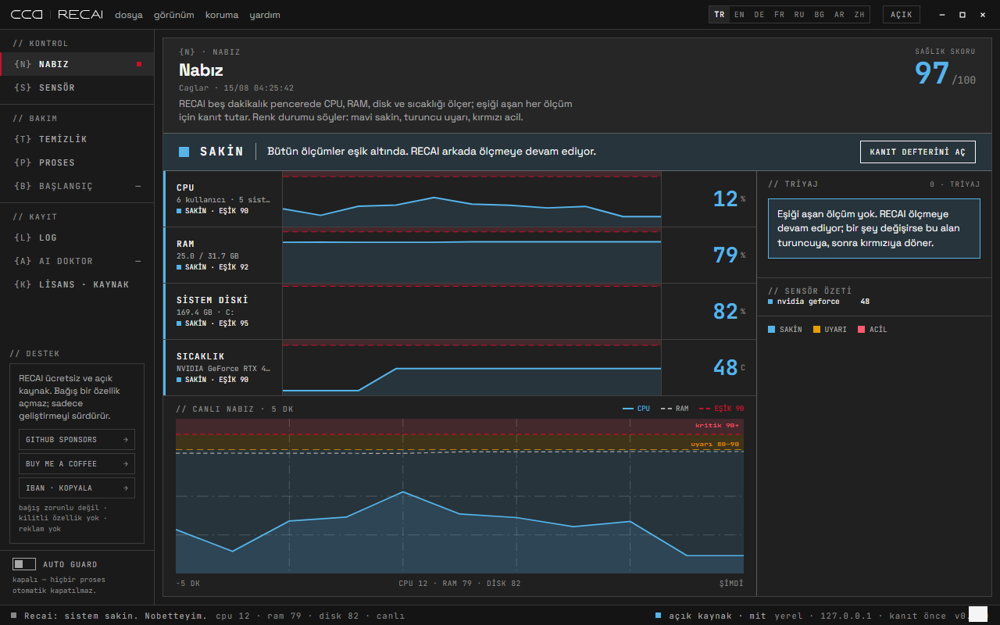
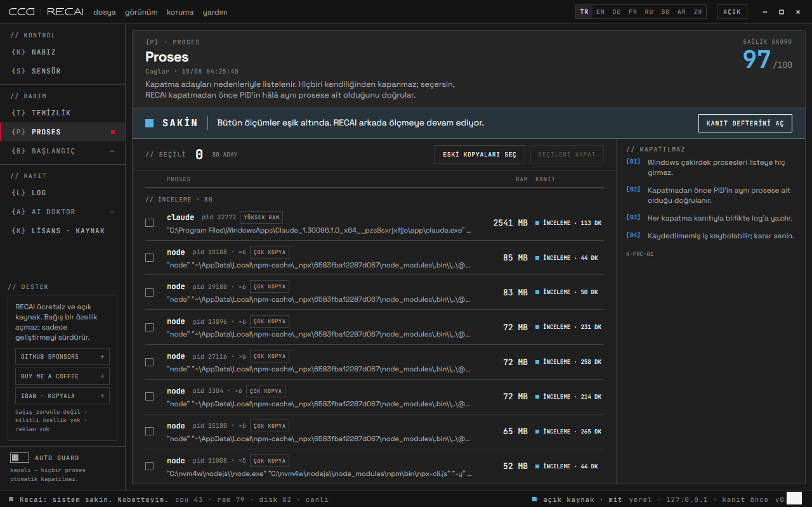
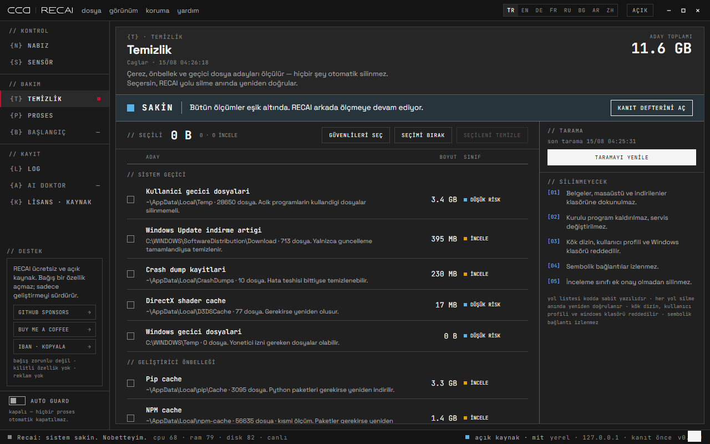
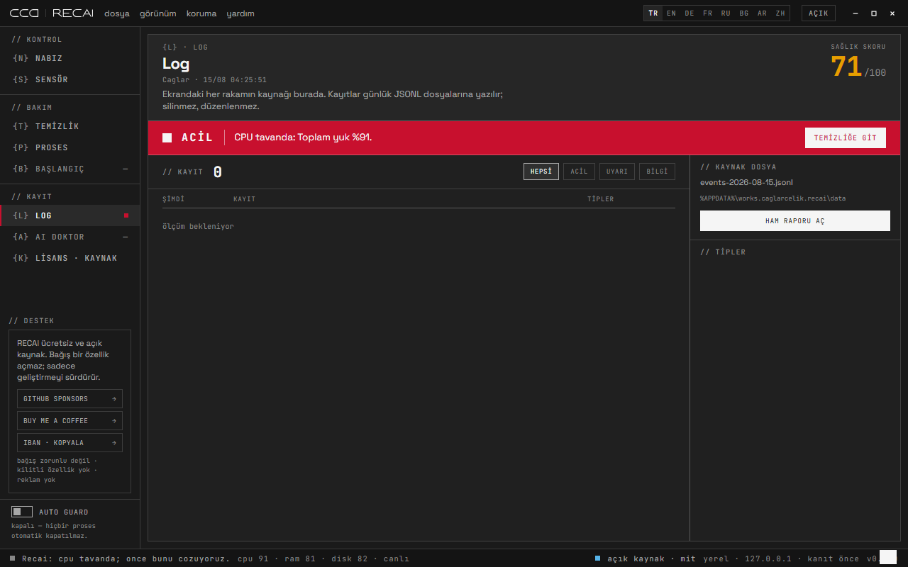
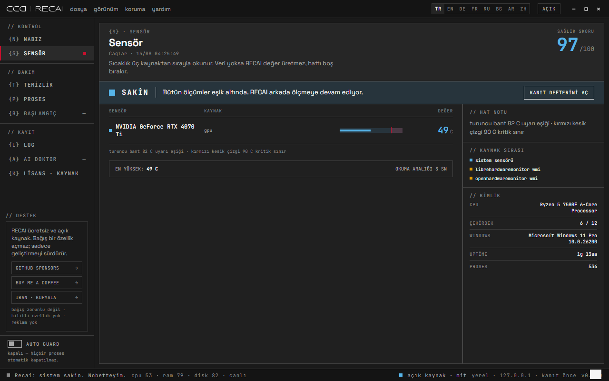
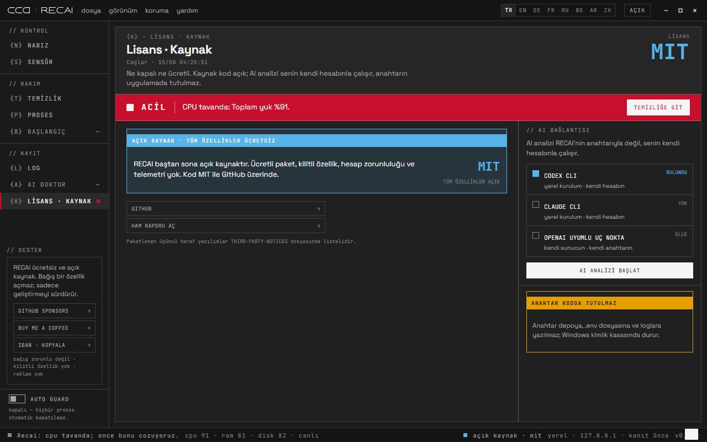
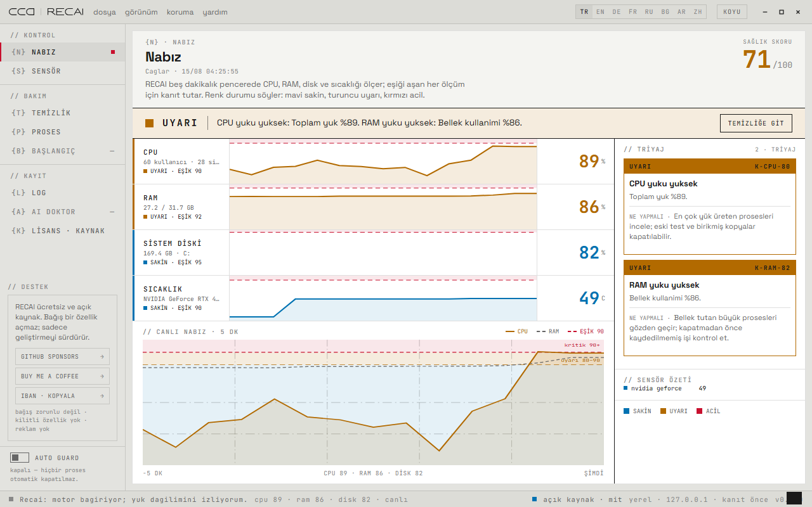

<a href="LICENSE"></a>

# CCA-RECAI

*🇬🇧 English · [🇹🇷 Türkçe](README.tr.md)*


<p align="center">
  
</p>

> **The code in this repository is open-source under the MIT License.**

A local health monitor for Windows that refuses to guess. It samples CPU, RAM,
disks and temperature every three seconds, writes what it saw into plain JSONL
files, and shows you the evidence behind every verdict. It runs entirely on
`127.0.0.1` — no cloud, no telemetry, no account, no paid tier.

The rule under every feature is the same: **no action without evidence.** If a
sensor cannot be read, the line stays empty instead of printing a number. If a
process is a termination candidate, you see why before anything happens. If a
folder can be cleaned, you see its path, its size and its risk class — and
nothing is deleted until you say so.

This started as a personal irritation: the machine got slow, Task Manager showed
a wall of identical `node.exe` rows, and nothing explained which of them mattered.
The first version was a browser tab; that was not software, so it became a real
desktop application. Along the way it went through three interface rebuilds, a
Windows path bug that only appeared when the app launched itself, and a
content-security policy that silently swallowed every colour. Those are written
down in `docs/` rather than forgotten. It is genuinely in use, and it is open to
contributions — the thresholds, the rules and the cleanup allowlist are all meant
to be argued with.

> **Authors / Context**
> **Creative Computational Architecture — Caglar Celik Architects (CCA)**, 2026.
> Built in pair with Claude (Anthropic) and Codex; the interface was designed in
> Claude Design and rebuilt by hand in vanilla JavaScript.
> *Redefining space through computation.* A design praxis studio working across
> analysis, mathematics, art, geometry, philosophy, aesthetics, architecture and
> technology.
> 📷 [@caglarcelikarchitects](https://instagram.com/caglarcelikarchitects) · [caglarcelik.works](https://caglarcelik.works)

---

## How it works

A Rust shell carries a Node backend. The shell picks a free port, starts the
backend as a child process, binds it to a Windows Job Object so it can never
outlive the app, waits for the port, then points its webview at the local page.
The same backend runs standalone with `npm start`.

```
 measure                evidence                 decide                clean
 ───────                ────────                 ──────                ─────
 monitor.js  ──────►    rules.js    ──────►      app.js     ──────►    audit.js
 3s sampling            thresholds               the screen            allowlist
 systeminformation      + rule ids               + your click          only
 PowerShell sensors     store.js → JSONL
```

Every alert carries a rule id (`K-CPU-90`, `K-DSK-95`, `K-ISI-82`, `K-PRC-01`)
and lands as a line in `events-YYYY-MM-DD.jsonl`. The number on screen and the
line on disk are the same fact.

## The six screens

The interface is a fixed desk-and-paper layout: the chrome stays back, the sheet
is the work surface. Colour never carries meaning alone — every state is also
named in words, and the palette runs blue → amber → red so it survives colour
blindness.

| Pulse — read the machine in one glance | Processes — evidence before action |
|---|---|
|  |  |
| Four vitals, each with its own severity-coloured chart and threshold line, over a live five-minute pulse. The triage column turns each breach into a rule id and a plain sentence about what to do. | Candidates grouped by confidence, with the reason badges that put them there. `select old copies` keeps the newest of each duplicate group. Windows core processes never enter the list. |

| Cleanup — nothing goes without you | Log — every number traces to a file |
|---|---|
|  |  |
| Cache and temp candidates measured and grouped, each with its size and risk class. Review-class items need a second approval. The right column lists what is never touched. | The evidence ledger. Filter by severity, read the rule id, open the raw report. The source JSONL filename is on screen so the claim is checkable. |

| Sensors — honest about missing data | License · source — open by default |
|---|---|
|  |  |
| Windows does not expose CPU temperature on many desktops. RECAI reads three sources in order and, when all three fail, leaves the line empty and says which step failed. It never invents a value. | What you get and where your AI key lives. The key is never written to the repo, `.env` or the logs. |

Eight languages ship with the app (`tr en de fr ru bg ar zh`, Arabic right-to-left)
and both themes are first-class:

<p align="center">
  
</p>

## Install

Windows 10/11, x64. Both builds are unsigned, so SmartScreen warns on first run.

- **Portable** — unzip, double-click `cca-recai.exe`. Keep the three items
  (`cca-recai.exe`, `recai-node.exe`, `app/`) together.
- **Installer** — `CCA-RECAI_x64-setup.exe`, installs for the current user only.

Closing the window minimises to the tray; monitoring keeps running. Quit from the
tray menu. Logs live in `%APPDATA%\works.caglarcelik.recai\data`.

## Build from source

Node.js ≥ 22 and Rust ≥ 1.77.

```bash
npm install
npm start          # backend + browser UI on http://127.0.0.1:7331
npm run app        # desktop window (Tauri dev)
npm run app:build  # installer + release binaries
node scripts/make-portable.mjs   # portable folder in dist/
```

`npm run app:build` copies the Node binary you are running into
`src-tauri/binaries/` as the desktop sidecar, so the built app carries its own
runtime and does not depend on a system Node install.

## Safety model

| Boundary | Guarantee |
|---|---|
| Network | Binds `127.0.0.1` only. Foreign `Host` headers rejected (DNS-rebinding shield); mutating requests need a local `Origin`. |
| Processes | The PID is re-checked against the expected process name before the kill. Windows core processes never appear as candidates. |
| Cleanup | Only the hard-coded allowlist in `audit.js`, re-validated at delete time. Root directories, the user profile and the Windows folder are refused. Symlinks are never followed. |
| Backend lifetime | Attached to a Windows Job Object (`KILL_ON_JOB_CLOSE`) — it cannot outlive the shell, even if the shell is force-killed. |
| AI | Opt-in per click, read-only sandbox, your own account. It receives a compact metric summary — never file paths or log bodies. No API key lives in this app. |
| Privacy | No telemetry, no auto-update, no outbound calls. Home directories are shortened to `~` on screen so screenshots do not leak a username. |

## Rules and thresholds

Thresholds live in `src/rules.js` and are mirrored in the interface. If they
drift apart the interface lies, so they are meant to be changed together.

| Metric | Warning | Critical |
|---|---:|---:|
| CPU load | 80 | 90 |
| RAM used | 82 | 92 |
| Disk used | 90 | 95 (or free < 15 GB) |
| Temperature | 82 °C | 90 °C |

A process becomes a candidate for one of seven reasons: a stale test runner, an
accumulated duplicate bridge, high CPU, a spike against its own learned baseline,
high RAM, an orphaned load, or too many identical copies.

## Files

| Path | What lives here |
|---|---|
| `src/monitor.js` | 3-second sampling loop, snapshot assembly, Windows events |
| `src/rules.js` | Thresholds, rule ids, candidate detection, health score |
| `src/audit.js` | Storage audit and the cleanup allowlist |
| `src/windows.js` | PowerShell bridge: sensors, event log, termination |
| `src/store.js` | JSONL evidence writer |
| `public/` | Interface: shell, screens, eight language files |
| `src-tauri/src/main.rs` | Desktop shell: sidecar, tray, frameless window |
| `docs/` | Architecture decision records |

## Roadmap

- ✅ ~~Desktop shell with tray and single-instance~~
- ✅ ~~Six-screen interface, eight languages, both themes~~
- ✅ ~~Evidence ledger with rule ids~~
- Startup-entry screen (`{B}`) and a dedicated AI doctor screen (`{A}`)
- Embedded LibreHardwareMonitor reads for machines with no temperature API
- Bundled OFL fonts so the app never reaches for a font CDN
- Signed binaries

Contributions welcome — especially argument about the thresholds and the
cleanup allowlist.

## Tools & Credits

| Tool | Used for |
|---|---|
| [Node.js](https://nodejs.org) | Backend runtime, bundled as the desktop sidecar |
| [systeminformation](https://github.com/sebhildebrandt/systeminformation) | CPU, memory, disk and graphics metrics |
| [Tauri 2](https://tauri.app) | Desktop shell, tray, installer |
| PowerShell / WMI | Temperature sensors, Windows event log, process control |
| [LibreHardwareMonitor](https://github.com/LibreHardwareMonitor/LibreHardwareMonitor) | Optional temperature source, read at runtime if installed |
| Claude (Anthropic) · Codex | Pair programming and the interface rebuild |
| Space Grotesk · JetBrains Mono | Typography |

## License

<p align="left">
  <picture>
    <source media="(prefers-color-scheme: dark)" srcset="docs/media/recai-wordmark-dark.svg">
    
  </picture>
</p>

The code is released under the [MIT License](LICENSE). The CCA and RECAI marks,
the wordmark and the interface artwork are **not** covered by MIT and remain the
property of their author. Bundled third-party software is listed in
[THIRD-PARTY-NOTICES.md](THIRD-PARTY-NOTICES.md).

Copyright (c) 2026 Creative Computational Architecture — Caglar Celik Architects (CCA)
